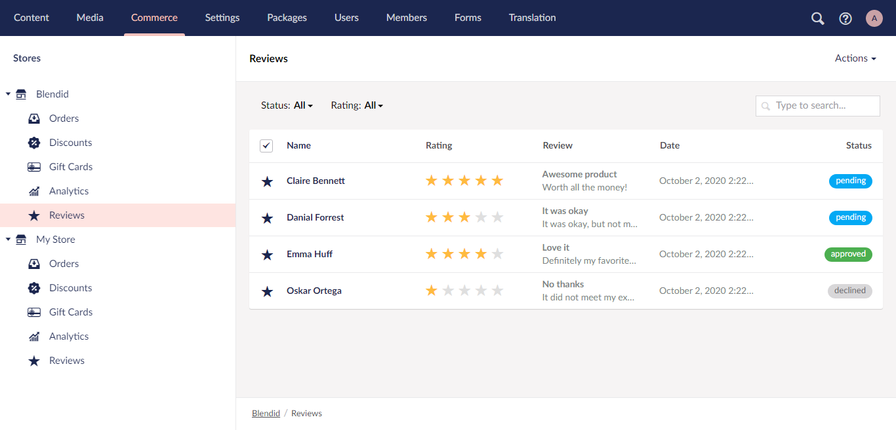

# Vendr Reviews :star::star::star::star::star:

Simple product reviews for Vendr, the eCommerce package for Umbrao v8+



Basic functionality to view and manage product reviews in Vendr.

## Instalation

Add the following using statement to your product page view:

````
@using Vendr.Contrib.Reviews.Web;
````

Then in the location you wish to render the reviews add:

```
@Html.RenderVendrReviews(store.Id, Model.Key.ToString())
```

## TODO

- [x] Add example of basic review form on product page.
- [x] Extract reviews for product and calculated average score.
- [x] Add tree nodes for each store in backoffice.
- [x] Add paged list of reviews in backoffice with filter options.
- [x] Search reviews in specific properties.
- [x] Add page to view and edit some properties on review.
- [x] Allow to delete review(s).
- [x] Allow to change status of review(s).
- [x] Reply/comment on review.
- [x] Change review UpdateDate on save.
- [x] Add email field to review.
- [x] Show product details like sku and product name on edit page.
- [x] Recommend this product (yes/no).
- [x] Verified buyer (yes/no).
- [ ] Votes positive / negative
- [ ] Add basic configuration (e.g. as config file).
